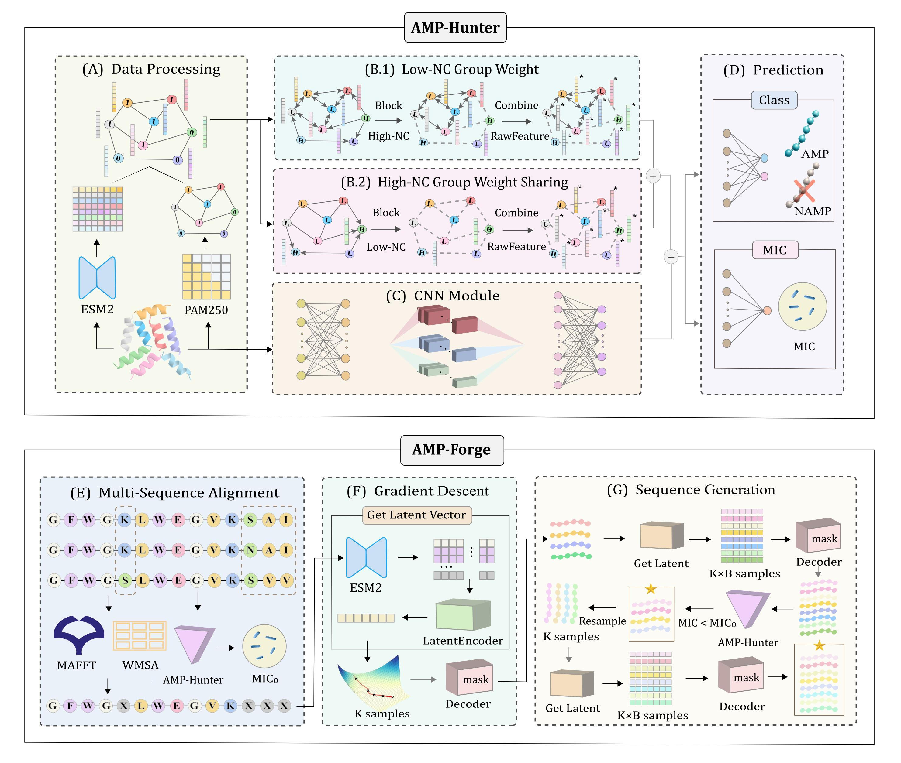

# Multi Task AMP Discriminator based on Multi Scale Feature Fusion and AMP Generator Guided by MIC
### This framework includes 2 parts:  
**AMP-Hunter** (a multi-task discriminator that fuses convolutional neural networks with graph neural networks) in AMP classification and MIC predictiontask.  
**AMP-Forge** (a generator that integrates multi sequence alignment method to select original candidates) and is guided by minimum inhibitory concentration (MIC) to optimize sequences.  

  

## 🔖 Data Available  
For **AMP-Hunter**, the data is provided in the [./AMP-Hunter/AMP_dataset/raw/data.txt](./AMP-Hunter/AMP_dataset/raw/data.txt)  
For **AMP-Forge**, the data is provided in the [./AMP-Forge/preprocessed_data/AMP/amp.csv](./AMP-Forge/preprocessed_data/AMP/amp.csv) 

## Python Environment Setup
For **AMP-Hunter**，the required runtime environment configuration file is: [environment4discrimination.yaml](./AMP-Hunter/environment4discrimination.yaml)  

The relevant environment can be configured using the following command:
```
conda env create -f environment4discrimination.yaml
source activate AMP-Hunter
conda activate AMP-Hunter
```

For **AMP-Forge**，the required runtime environment configuration file is: [environment4generation.yaml](./AMP-Forge/environment4generation.yaml)  

The relevant environment can be configured using the following command:
```
conda env create -f environment4generation.yaml
source activate AMP-Forge
conda activate AMP-Forge
```

## Download ESM2 Model  
The ESM2 model is used in AMP-Hunter to extract features as node features, and serve as an encoder for extract residual-level features of the sequences in AMP-Forge.  
Please download the required files.  
👉 Recommended download (config.json, pytorch_model.bin, special_tokens_map.json, tokenizer_config.json, vocab.txt) from the [huggingface](https://huggingface.co/Rocketknight1/esm2_t33_650M_UR50D/tree/main) 
and place them in the [./AMP-Forge/esm2_model](./AMP-Forge/esm2_model) path.  

## 1️⃣ AMP-Hunter
## Preprocess Data for AMP-Hunter  
### Obtain the sequence-level features extracted by esm2  
In the [./AMP-Hunter/graph_process](./AMP-Hunter/graph_process) path
```
python get_feature_pretrain.py
```
### Obtain the similarity matrix to derive the edge information of the graph  
```
python calculate_similarity_matrix.py
```

## Get Embeddings for AMP-Hunter  
Please update the data path and file name in the [./AMP-Hunter/AMP_dataset/processed](./AMP-Hunter/AMP_dataset/processe) path  
### Obtain the embeddings extracted by GCN  
#### For classification 
```
python get_NCGCN_embedding.py -D AMP_class 
```
#### For regression 
```
python get_NCGCN_embedding.py -D AMP_reg 
```

### Obtain the embeddings extracted by CNN  
The training set, validation set, and test set should be partitioned in an 8:1:1 ratio to match the distribution in NCGCN.  
One of the partitions is provided under the [./AMP-Hunter/AMP_dataset/raw](./AMP-Hunter/AMP_dataset/raw) path.
```
python get_CNN_embedding.py 
```

## Run AMP-Hunter for Classification and Regression task
```
python discriminate.py
```

#### Please switch the related code in the 3 files in [./AMP-Hunter/get_embedding](./AMP-Hunter/get_embedding) path.

## 2️⃣ AMP-Forge  
## Train the VAE model  
In the [./AMP-Forge/scripts](./AMP-Forge/scripts) path
```
python train.py
```
During training, the best three model will be saved and one should be provided as command-line arguments when generating sequences.  

## Generate Optimized Sequences  
#### Please refer to the [./AMP-Forge/preprocessed_data/AMP/amp_sequence.txt](./AMP-Forge/preprocessed_data/AMP/amp_sequence.txt)  file for the sequences to be optimized and their MIC values.  
```
python generate.py
```


